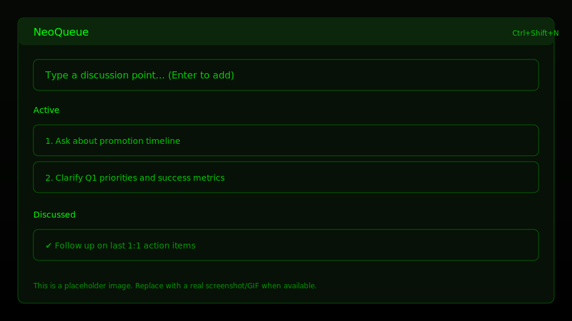

# NeoQueue

> *"Free your mind."* - A Matrix-inspired desktop app for tracking discussion points with your manager.


## What is NeoQueue?

NeoQueue is a friction-free tool for capturing and organizing discussion points you want to raise with your manager. Built with a Matrix-inspired dark theme, it's designed for speed and focus.

### Features

- ⚡ **Instant Capture** - Type your thought, hit Enter, done
- 📋 **One-Click Copy** - Copy any item to clipboard instantly
- 💬 **Follow-up Threading** - Add notes and comments to existing items
- ✅ **Completion Workflow** - Mark items as discussed, archive when done
- 💾 **Local Persistence** - Your data stays on your machine

## Quick Start

### Prerequisites

- Node.js 18 or later
- npm 9 or later

### Installation

```bash
# Clone the repository
git clone <repository-url>
cd neoqueue

# Install dependencies
npm install

# Start development mode
npm run dev
```

### Building

```bash
# Build for production
npm run build

# Package for distribution
npm run package
```

### Packaging notes

- The packaged app includes a tray icon and global shortcuts.
- **Linux AppImage:** Some systems (and WSL) may fail to run AppImages with an error like `libfuse.so.2: cannot open shared object file`. Install `libfuse2` (or your distro equivalent) and try again.
- **Windows:** If you see SmartScreen warnings for unsigned builds, this is expected for local/test builds.
- **macOS:** You may need to right-click → Open the first time (Gatekeeper) for unsigned local builds.

## Usage



1. **Add an item**: Type in the input box and press Enter
2. **Copy to clipboard**: Click the copy button next to any item
3. **Add follow-up**: Click an item to expand, then add your note
4. **Mark complete**: Click the checkmark when you've discussed an item (moves it to **Discussed**)
5. **Use the tray**: Keep NeoQueue running in the system tray for quick access

## Keyboard Shortcuts

### In-app

| Shortcut | Action |
|----------|--------|
| `Ctrl+N` / `Cmd+N` | Focus new item input |
| `Enter` | Add item / confirm |
| `Escape` | Cancel / close |
| `Tab` | Navigate between interactive controls |

### Global (works even when NeoQueue is not focused)

| Shortcut | Action |
|----------|--------|
| `Ctrl+Shift+N` / `Cmd+Shift+N` | Show NeoQueue + focus new item input |
| `Ctrl+Shift+Q` / `Cmd+Shift+Q` | Toggle NeoQueue window visibility |

## System Tray

- **Double-click** the tray icon to show NeoQueue
- Tray menu:
  - **New Item** (triggers global new-item behavior)
  - **Show NeoQueue**
  - **Quit**

## Tech Stack

- **Electron** - Cross-platform desktop framework
- **React** - UI library
- **TypeScript** - Type-safe JavaScript
- **Vite** - Fast build tool

## Project Structure

```
src/
├── main/       # Electron main process
├── renderer/   # React frontend
└── shared/     # Shared types and utilities
```

## Development

See [AGENTS.md](./AGENTS.md) for detailed development guidelines.

## License

MIT

---

*Built with 💚 in the Matrix*
